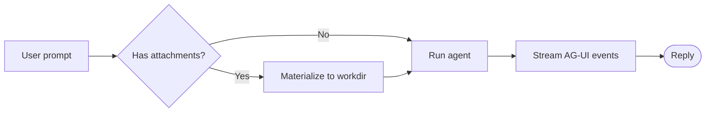

# Sample Document Demonstrating Full Markdown Features


## Overview

**Markdown** is created by [John Gruber](http://daringfireball.net/), the original guideline is [here](http://daringfireball.net/projects/markdown/syntax). Its syntax, however, varies between different parsers or editors. **This Render** is using [GitHub Flavored Markdown][GFM].

In addition to standard Markdown documentation, this document highlights or supplements the following capabilities.

## 1. Tables

Input `| First Header  | Second Header |` and press the `return` key. This will create a table with two columns.

After a table is created, putting focus on that table will open up a toolbar for the table where you can resize, align, or delete the table. You can also use the context menu to copy and add/delete individual columns/rows.


In markdown source code, they look like:

| First Header | Second Header |
| ------------ | ------------- |
| Content Cell | Content Cell  |
| Content Cell | Content Cell  |

You can also include inline Markdown such as links, bold, italics, or strikethrough in the table.

Finally, by including colons (`:`) within the header row, you can define text in that column to be left-aligned, right-aligned, or center-aligned:

| Left-Aligned  | Center Aligned  | Right Aligned |
| :------------ |:---------------:| -----:|
| col 3 is      | some wordy text | $1600 |
| col 2 is      | centered        |   $12 |
| zebra stripes | are neat        |    $1 |

## 2. Code Blocks


Supports fences in GitHub Flavored Markdown. Original code blocks in markdown are not supported.

Using fences is easy: Input \`\`\` and press `return`. Add an optional language identifier after \`\`\` and we'll run it through syntax highlighting:

````gfm
Here's an example:

```js
function test() {
  console.log("notice the blank line before this function?");
}
```

syntax highlighting:
```ruby
require 'redcarpet'
markdown = Redcarpet.new("Hello World!")
puts markdown.to_html
```
````

## 3. Diagrams (Mermaid)

It renders  [mermaid](https://mermaid.js.org/intro/) diagrams from a fenced code
block tagged `mermaid`. The block shows a **Render / Code** toggle so you can
flip between the rendered diagram and its source.

A flowchart:



## 4. Charts (Vega-Lite)

It renders [Vega-Lite](https://vega.github.io/vega-lite/) charts from a fenced
code block tagged `vega-lite` whose body is a Vega-Lite JSON spec. Like Mermaid,
it offers a **Render / Code** toggle. Each spec is self-contained — the data is
inlined under `data.values`, so the chart needs no network access.

The examples below are a small gallery of **finance / markets** chart patterns.

### 4.1 Stock price over time (line)

A single ticker's weekly close — the most common time-series chart.

```vega-lite
{
  "$schema": "https://vega.github.io/schema/vega-lite/v5.json",
  "title": "ACME Corp — Weekly Close (USD)",
  "data": {
    "values": [
      {"date": "2024-01-02", "close": 184.2},
      {"date": "2024-01-09", "close": 188.6},
      {"date": "2024-01-16", "close": 181.9},
      {"date": "2024-01-23", "close": 193.4},
      {"date": "2024-01-30", "close": 199.1},
      {"date": "2024-02-06", "close": 195.7},
      {"date": "2024-02-13", "close": 204.8},
      {"date": "2024-02-20", "close": 211.3},
      {"date": "2024-02-27", "close": 207.6},
      {"date": "2024-03-05", "close": 218.9}
    ]
  },
  "mark": {"type": "line", "point": true},
  "encoding": {
    "x": {"field": "date", "type": "temporal", "title": "Date"},
    "y": {"field": "close", "type": "quantitative", "title": "Close (USD)", "scale": {"zero": false}}
  }
}
```

### 4.2 Candlestick / OHLC (rule + bar)

Open-high-low-close candles: a `rule` for the high–low wick and a `bar` for the
open–close body, colored green/red by up/down day via a conditional.

```vega-lite
{
  "$schema": "https://vega.github.io/schema/vega-lite/v5.json",
  "title": "ACME Corp — Daily OHLC",
  "data": {
    "values": [
      {"date": "2024-03-01", "open": 200.1, "high": 206.4, "low": 198.7, "close": 205.2},
      {"date": "2024-03-04", "open": 205.5, "high": 209.0, "low": 203.1, "close": 203.9},
      {"date": "2024-03-05", "open": 204.0, "high": 212.5, "low": 203.8, "close": 211.7},
      {"date": "2024-03-06", "open": 211.9, "high": 214.2, "low": 207.3, "close": 208.4},
      {"date": "2024-03-07", "open": 208.6, "high": 215.8, "low": 208.0, "close": 214.9},
      {"date": "2024-03-08", "open": 215.1, "high": 218.7, "low": 212.4, "close": 213.0},
      {"date": "2024-03-11", "open": 213.2, "high": 220.1, "low": 212.9, "close": 219.5}
    ]
  },
  "encoding": {
    "x": {"field": "date", "type": "temporal", "title": "Date"},
    "color": {
      "condition": {"test": "datum.open < datum.close", "value": "#16a34a"},
      "value": "#dc2626"
    }
  },
  "layer": [
    {
      "mark": "rule",
      "encoding": {
        "y": {"field": "low", "type": "quantitative", "scale": {"zero": false}, "title": "Price (USD)"},
        "y2": {"field": "high"}
      }
    },
    {
      "mark": "bar",
      "encoding": {
        "y": {"field": "open", "type": "quantitative"},
        "y2": {"field": "close"}
      }
    }
  ]
}
```

### 4.3 Indexed returns — multiple tickers (multi-series line)

Compare several tickers on a common base (rebased to 100) so relative
performance is easy to read.

```vega-lite
{
  "$schema": "https://vega.github.io/schema/vega-lite/v5.json",
  "title": "Indexed Total Return (Base = 100)",
  "data": {
    "values": [
      {"month": "2024-01", "ticker": "ACME", "index": 100},
      {"month": "2024-02", "ticker": "ACME", "index": 108},
      {"month": "2024-03", "ticker": "ACME", "index": 115},
      {"month": "2024-04", "ticker": "ACME", "index": 112},
      {"month": "2024-05", "ticker": "ACME", "index": 124},
      {"month": "2024-06", "ticker": "ACME", "index": 131},
      {"month": "2024-01", "ticker": "GLOBEX", "index": 100},
      {"month": "2024-02", "ticker": "GLOBEX", "index": 96},
      {"month": "2024-03", "ticker": "GLOBEX", "index": 103},
      {"month": "2024-04", "ticker": "GLOBEX", "index": 109},
      {"month": "2024-05", "ticker": "GLOBEX", "index": 107},
      {"month": "2024-06", "ticker": "GLOBEX", "index": 118},
      {"month": "2024-01", "ticker": "S&P 500", "index": 100},
      {"month": "2024-02", "ticker": "S&P 500", "index": 105},
      {"month": "2024-03", "ticker": "S&P 500", "index": 108},
      {"month": "2024-04", "ticker": "S&P 500", "index": 106},
      {"month": "2024-05", "ticker": "S&P 500", "index": 111},
      {"month": "2024-06", "ticker": "S&P 500", "index": 114}
    ]
  },
  "mark": {"type": "line", "point": true},
  "encoding": {
    "x": {"field": "month", "type": "ordinal", "title": "Month"},
    "y": {"field": "index", "type": "quantitative", "title": "Index", "scale": {"zero": false}},
    "color": {"field": "ticker", "type": "nominal", "title": "Ticker"}
  }
}
```

### 4.4 Quarterly revenue (bar)

A simple categorical bar chart of revenue by quarter.

```vega-lite
{
  "$schema": "https://vega.github.io/schema/vega-lite/v5.json",
  "title": "Quarterly Revenue (USD millions)",
  "data": {
    "values": [
      {"quarter": "Q1'23", "revenue": 312},
      {"quarter": "Q2'23", "revenue": 348},
      {"quarter": "Q3'23", "revenue": 401},
      {"quarter": "Q4'23", "revenue": 455},
      {"quarter": "Q1'24", "revenue": 421},
      {"quarter": "Q2'24", "revenue": 489},
      {"quarter": "Q3'24", "revenue": 532},
      {"quarter": "Q4'24", "revenue": 604}
    ]
  },
  "mark": "bar",
  "encoding": {
    "x": {"field": "quarter", "type": "nominal", "title": "Quarter", "axis": {"labelAngle": 0}},
    "y": {"field": "revenue", "type": "quantitative", "title": "Revenue ($M)"},
    "tooltip": [
      {"field": "quarter", "type": "nominal"},
      {"field": "revenue", "type": "quantitative", "format": "$,.0f"}
    ]
  }
}
```

### 4.5 Revenue vs. margin (layered bar + line, dual axis)

Revenue as bars (left axis) with operating-margin % as a line (independent right
axis) — a classic management-reporting combo.

```vega-lite
{
  "$schema": "https://vega.github.io/schema/vega-lite/v5.json",
  "title": "Revenue vs. Operating Margin",
  "data": {
    "values": [
      {"quarter": "Q1'23", "revenue": 312, "margin": 11.2},
      {"quarter": "Q2'23", "revenue": 348, "margin": 12.5},
      {"quarter": "Q3'23", "revenue": 401, "margin": 13.1},
      {"quarter": "Q4'23", "revenue": 455, "margin": 14.0},
      {"quarter": "Q1'24", "revenue": 421, "margin": 13.6},
      {"quarter": "Q2'24", "revenue": 489, "margin": 15.2},
      {"quarter": "Q3'24", "revenue": 532, "margin": 16.4},
      {"quarter": "Q4'24", "revenue": 604, "margin": 17.9}
    ]
  },
  "encoding": {
    "x": {"field": "quarter", "type": "nominal", "title": "Quarter", "axis": {"labelAngle": 0}}
  },
  "layer": [
    {
      "mark": {"type": "bar", "color": "#3b82f6"},
      "encoding": {
        "y": {"field": "revenue", "type": "quantitative", "title": "Revenue ($M)"}
      }
    },
    {
      "mark": {"type": "line", "point": true, "color": "#ef4444"},
      "encoding": {
        "y": {"field": "margin", "type": "quantitative", "title": "Operating margin (%)", "scale": {"zero": false}}
      }
    }
  ],
  "resolve": {"scale": {"y": "independent"}}
}
```

### 4.6 Portfolio allocation (arc / donut)

An `arc` mark with `theta` gives a pie/donut breakdown of asset-class weights.

```vega-lite
{
  "$schema": "https://vega.github.io/schema/vega-lite/v5.json",
  "title": "Portfolio Allocation",
  "data": {
    "values": [
      {"asset": "Equities", "weight": 52},
      {"asset": "Fixed Income", "weight": 26},
      {"asset": "Real Estate", "weight": 9},
      {"asset": "Commodities", "weight": 7},
      {"asset": "Cash", "weight": 6}
    ]
  },
  "mark": {"type": "arc", "innerRadius": 60},
  "encoding": {
    "theta": {"field": "weight", "type": "quantitative", "stack": true},
    "color": {"field": "asset", "type": "nominal", "title": "Asset class"},
    "tooltip": [
      {"field": "asset", "type": "nominal"},
      {"field": "weight", "type": "quantitative", "format": ".0f"}
    ]
  }
}
```

### 4.7 Monthly returns heatmap

A `rect` mark with a diverging color scale shows monthly-return seasonality
across years (green = positive, red = negative).

```vega-lite
{
  "$schema": "https://vega.github.io/schema/vega-lite/v5.json",
  "title": "Monthly Returns (%)",
  "data": {
    "values": [
      {"year": "2022", "month": "Jan", "ret": -3.1},
      {"year": "2022", "month": "Feb", "ret": 1.8},
      {"year": "2022", "month": "Mar", "ret": 4.2},
      {"year": "2022", "month": "Apr", "ret": -2.4},
      {"year": "2022", "month": "May", "ret": 0.6},
      {"year": "2022", "month": "Jun", "ret": -5.0},
      {"year": "2023", "month": "Jan", "ret": 5.5},
      {"year": "2023", "month": "Feb", "ret": -1.2},
      {"year": "2023", "month": "Mar", "ret": 2.9},
      {"year": "2023", "month": "Apr", "ret": 1.1},
      {"year": "2023", "month": "May", "ret": 3.4},
      {"year": "2023", "month": "Jun", "ret": 2.0}
    ]
  },
  "mark": "rect",
  "encoding": {
    "x": {"field": "month", "type": "ordinal", "title": "Month", "sort": ["Jan", "Feb", "Mar", "Apr", "May", "Jun"]},
    "y": {"field": "year", "type": "ordinal", "title": "Year"},
    "color": {
      "field": "ret",
      "type": "quantitative",
      "title": "Return (%)",
      "scale": {"scheme": "redyellowgreen", "domainMid": 0}
    },
    "tooltip": [
      {"field": "year", "type": "ordinal"},
      {"field": "month", "type": "ordinal"},
      {"field": "ret", "type": "quantitative", "format": ".1f"}
    ]
  }
}
```

## 5. Images and media

The renderer uses standard Markdown image syntax ``
for **all** media. The viewer is chosen automatically from the file extension, so
the same `` works for images, video, audio, PDFs, and other files:

| Content type | Markdown | Rendered as |
|---|---|---|
| Image | `` | inline image + "View Original" button |
| Video | `` | inline video player |
| Audio | `` | inline audio player |
| PDF | `` | inline PDF viewer |
| Other files | `` | downloadable file link |

A path can be relative to the document (resolved automatically) or a full
`http(s)://` URL for a remote image.

Some tests:


Here are some html/iframe tests:


iframe without caption and width 400px and height 600px :


## 6. Footnotes

You can create footnotes like this[^footnote].

[^footnote]: Here is the *text* of the **footnote**.

[GFM]: https://github.github.com/gfm/
